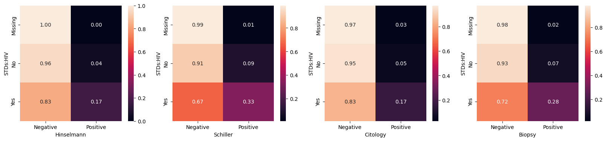
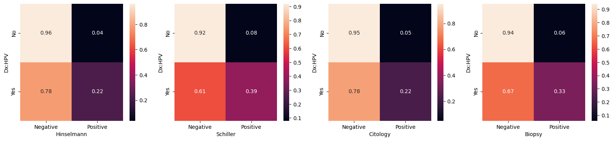

# Predicting Cervical Cancer Test Results
Cervical cancer is one of the leading causes of death for women in many countries. Cervical cancer is preventable and treatable, so we should be stepping up and finding ways of helping make sure women get the help they need.
One of the main issues in third world countries is that women don't have easy access to testing and treatment. This project aims to find out if we can predict cervical cancer test results in women based on the common risk factors so they can know if they should seek out additional testing or treatment.

# Data
This project uses data collected from a survey conducted at a hospital in Venezuela. It consists of 858 patients and their demographic information as well as medical records that are all risk factors for cervical cancer.
Link to data: https://archive.ics.uci.edu/dataset/383/cervical+cancer+risk+factors 

# Data Cleaning
The prevailing problem in this dataset is the number of missing values. Due to some of the risk factors being private information, many of the patients left a large portion of the questions on the survey blank, resulting in quite a few missing values in the data.
Most of the missing data came from one group of the participants in the survey (about 12%), so I had initially decided to add a new column to the data denoting if the specific participant in the survey was part of that "missing" group.
Multiple datasets were saved, one with the records containing all the missing values dropped, or having some value imputed for them. There were also different sets containing standardized data and others without the standardized data.

# EDA
The specific cervical cancer test results this project was made to predict is the Schiller test. This test was the most sensitive to the following features in our data:

•	Vulvo-perineal condylomatosis\
•	HIV\
•	Dx: Cancer\
•	Dx: HPV\

The diagnoses don't necessarily make sense to use to predict our test results, but it helped to be sure that this test was one that had a stronger relationship with an actual diagnosis.

# Modeling
For this project, I tested logistic regression, random forest, and SVM models with F1-macro as a scoring method. I chose to use F1-macro as we are looking at cancer data, where there are very few positive cases and F1-macro deals with imalanced classes well.

Precision is the ratio of true positive predictions to the total predicted positives, showing how many of the cases predicted to be postiive were correct. Recall is the ratio of true positive predictions to total actual positives, showing how many of the actual positive cases were correctly identified. F1 is the harmonic mean of the two, giving a good balance between them.

The 'macro' in F1-macro means that we calculate the F1 for each class separately and take the average. This means we treat both classes equally, so we don't give too much weight to the cases where patients tested negative, which is the much bigger class. This ensures we get optimal precision and accuracy for positive test cases as well so the predictions don't miss all of the positive test cases.

|                     | Best Score | Train Time |
| ------------------- | ---------- | ---------- |
| Logistic Regression | 0.851064   | 13.617378  |
| Random Forest       | 0.888462   | 181.422026 |
| SVM                 | 0.872447   | 0.139997   |

The random forest model had the highest f1 macro score at .88 while the SVM trailed closely behind at .87. Because the models were optimized at train time, some of them took a longer time to train. The random forest model took 181 seconds to train while the SVM model only tok .14 seconds.

The models are both very accurate, but these predictions of the Schiller test results are made given the results from the other three tests. This may not be very helpful as if someone has gotten testing done, they might as well have gotten all four of the tests done, making these models' predictions not matter because the patient would ideally already have gotten the Schiller test. Upon removing the second most significant cancer test from the data and re-training our SVM model, we get a reduced F1-macro of 0.86. Dropping another test results in a score of .63.

This could be helpful if, for some reason, the hospital would not want to conduct all four of the tests on patients. If two tests are performed, we can have reasonable accuracy in predicting the results of the other two tests. However, when we remove the other tests entirely from the data, the prediction becomes pretty useless as we get very low accuracy. For real life purposes, it would be best to continue testing patients as usual.

# Which dataset was best?
The final dataset used was the one with standardized numerical values, mean imputation for the missing numerical values, and the patients who left the large chunk of questions blank were dropped.

This decision was relatively easy to make as it was more or less tied with highest accuracy with the same dataset just without non-standardized data, but the non-standardized data caused the models to take much longer to train.

# Future Improvements
In future iterations of the project, it would be more useful to try to predict the actual cancer diagnosis over the tests. If we can accurately predict the presence of cancer without even testing patients, we could potentially help save more patients who otherwise wouldn't bother with (or couldn't access) testing and treatment.

There is likely better feature engineering to be done to improve the predictive power of these models on this type of data.